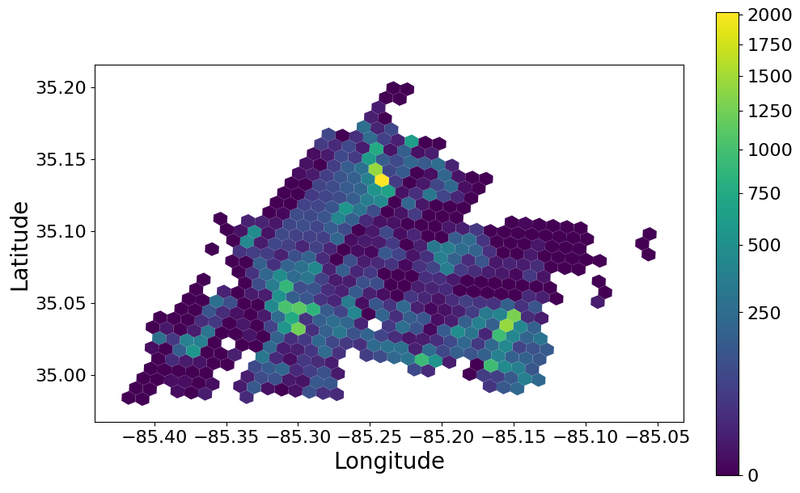
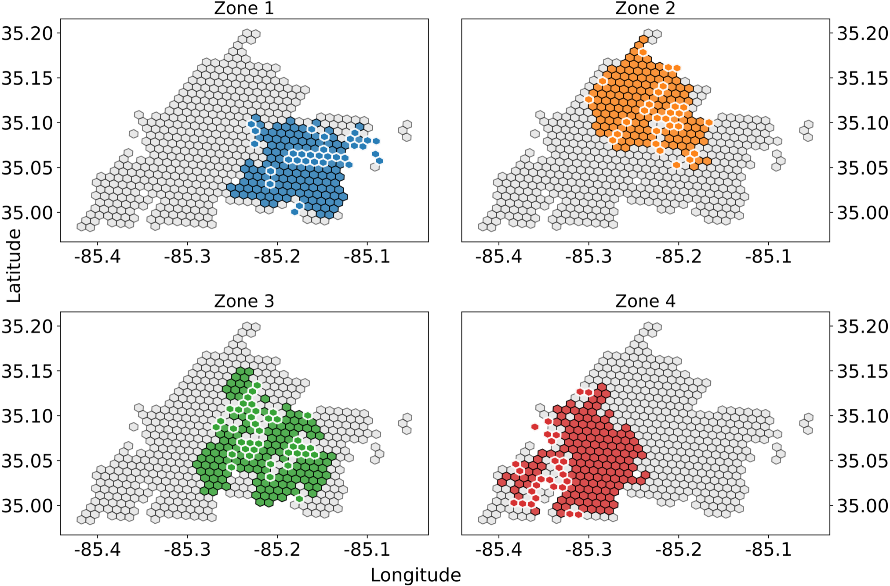

# CG-Zoning: Column Generation for the Micro-Transit Zoning Problem

[](https://arxiv.org/abs/2603.07821)

[](LICENSE)


Reference implementation for the paper **"Column Generation for the
Micro-Transit Zoning Problem"** (IJCAI-ECAI 2026). The code selects
micro-transit service zones under a global budget to maximize intra-zone
demand coverage. The zoning problem is solved by column generation (CG) with
either exact pricing (ILP or IQP) or a randomized pricing heuristic. A
method based on CliqueGen + Integer Linear Programming (ILP) is included as the baseline.

<p align="center">
  <a href="assets/demand_chattanooga.png">
    
  </a>
</p>
<p align="center">
  <a href="assets/zones_chattanooga.png">
    
  </a>
</p>
<p align="center"><em>From aggregated OD demand (top) to budget-constrained micro-transit zones (bottom), Chattanooga at H3 resolution 8. Click either figure for the full-resolution version.</em></p>

## Repository layout

```
cg/                     CG algorithm package
├── algo.py             CG core: column_generation, solve_pricing (ILP),
│                       solve_pricing_QP (IQP), pricing heuristics (Alg 1)
├── connectivity_repair.py  Cost-preserving zone patching (Appendix Alg 2)
├── equity.py           Cell-level equity scores from ACS Census data
└── utils.py            Block graph construction, evaluators, Gurobi license
cliquegen/              CliqueGen baseline algorithms
experiments/            All experiment entry points
├── run_cg.py           CG entry point
├── run_cliquegen.py    CliqueGen baseline entry point
├── run_equity_case_study.py     Equity case study
├── render_figure4.py   Figure 4 rendering script
├── render_demand_map.py         Aggregated demand heatmaps for a city
├── average_results.py  Average total demand served over repeated runs
└── shared/             Data prep, result writing, and plotting modules
tests/                  Unit tests
data/                   Input data (git-ignored, see data/README.md)
output/                 Experiment outputs (git-ignored)
```

## Installation

Python 3.10 or newer is required.

**macOS (pip):**

```bash
python3 -m venv .venv
source .venv/bin/activate
pip install -r requirements-macos.txt
```

**Linux / cluster (conda):**

```bash
conda env create -f environment.yml
conda activate mzones
```

## Configure the Gurobi license

The solver uses a Gurobi WLS license. **Credentials are never stored in source
control.** They are read from environment variables:

| Variable          | Meaning            |
| ----------------- | ------------------ |
| `GRB_WLSACCESSID` | WLS access ID      |
| `GRB_WLSSECRET`   | WLS secret         |
| `GRB_LICENSEID`   | Numeric license ID |

To configure:

1. Copy the template: `cp .env.example .env`
2. Fill in your own Gurobi WLS license in `.env`.
3. `.env` is listed in `.gitignore` and must **never** be committed.

The code loads `.env` automatically (via `python-dotenv`) in
`cg.utils.get_grb_license()`. Alternatively, export the three variables in
your shell.

> [!IMPORTANT]
> Never commit `.env`, and never hard-code license keys, API tokens, or any
> other secret anywhere in the repository. Secrets live in `.env` only.

## Get the data

The experiment scripts expect the per-city input files under `data/`. The bundle for the
five paper cities is about 810 MB and is not shipped in the repository. See
`data/README.md` for the file inventory and how to obtain or regenerate each
piece (`data/cities.ipynb` is the interactive reference implementation of the
data generation steps).

> [!NOTE]
> **Data availability.** All demand files share one schema, so the code makes
> no distinction between data sources. Some of the underlying data cannot be
> redistributed. The Chattanooga weekday OD table used in the paper is derived
> from a proprietary commercial mobility dataset whose license permits neither
> redistribution of the raw data nor disclosure of the vendor. This repository
> therefore ships aggregate results only. Road networks, H3 hex maps, and
> center-distance caches are derived from open data (OpenStreetMap, Census
> TIGER) and can be regenerated with the steps in `data/README.md`. To
> reproduce the Chattanooga experiments, place your own OD table in the same
> schema at `data/demand_chatt.csv`.

## Run an experiment

Always run from the repo root so `data/` and `output/` resolve.

CG with the randomized pricing heuristic (paper parameters):

```bash
python experiments/run_cg.py \
  --city chatt --resolution 8 \
  --budget 8 --alpha 5 --beta 1 --single_zone_budget 2 \
  --pricing_method random_init --num_random_runs 10 \
  --output_dir output/my_run
```

CG with exact ILP pricing: pass `--pricing_method exact_ilp`. Exact IQP
pricing: `--pricing_method exact_qp`.

CliqueGen baseline:

```bash
python experiments/run_cliquegen.py \
  --city chatt --resolution 8 \
  --budget 8 --alpha 5 --beta 1 --single_zone_budget 2 \
  --output_dir output/my_baseline_run
```

The default parameters of the experiment scripts match the paper baseline: total budget `B = 8`,
cost slope `alpha = 5`, cost intercept `beta = 1`, single-zone budget
`B0 = 2`, and `R = 10` heuristic restarts (`--num_random_runs 10`).

## Reproduce the paper results

### Ground rules

Read these before running anything.

1. **Expect close numbers, not identical ones.** The pricing heuristic is
   randomized and the paper runs did not fix random seeds, so coverage
   results reproduce only up to run-to-run variation (within about one
   percentage point in our own reruns). Solver outcomes can also shift
   slightly across Gurobi versions and thread counts.
2. **Do not try to reproduce absolute runtimes.** All timings in the paper
   (Tables 2 and 4) were measured on an AWS instance with 4 CPUs
   and 8 GiB memory. On different hardware only the relative conclusions
   are expected to hold, for example exact pricing being orders of
   magnitude slower than the heuristic, and CliqueGen failing on large
   instances.
3. **The Chattanooga demand is proprietary.** The experiment scripts read
   `data/demand_{city}.csv` uniformly for every city. The paper's
   Chattanooga runs used a proprietary weekday OD table, which cannot be redistributed. Substitute your
   own OD table in the same schema (see the Data availability note above).
4. **Coverage** for one run is the value in `total_demand_served.txt`
   divided by the "The total demand is" line printed in the run log.
5. **Use the paper time limits.** Exact pricing: `--cg_time_limit 36000
   --pricing_time_limit 3600` (10 hours for CG, 1 hour per pricing
   problem). Heuristic: `--cg_time_limit 1200 --pricing_time_limit 120`.

All instances use the paper cost parameters
(`--budget 8 --alpha 5 --beta 1 --single_zone_budget 2`) on Miami, Boston,
Atlanta, Chattanooga, and Nashville at H3 resolutions 7 and 8.

### Recipes per result

| Result | Recipe |
| --- | --- |
| Table 2 (runtime, CliqueGen vs CG + exact pricing) | Not reproducible in absolute terms (rule 2). Running both methods on your own hardware can only confirm the qualitative gap. |
| Figure 3 (coverage under a 1200 s budget, 5-run average) | See the recipe below. |
| Table 3 (coverage, exact ILP vs pricing heuristic) | Per instance, run `run_cg.py` once with `--pricing_method exact_ilp` and once with `--pricing_method random_init --num_random_runs 10`, then compute coverage (rule 4). Nashville res-8 exact is expected to time out. |
| Table 4 (runtime, ILP vs IQP exact pricing) | Not reproducible in absolute terms (rule 2). |
| Figure 4 (Chattanooga res-8 zones with patching) | Not reproducible as published because it depends on the proprietary Chattanooga demand (rule 3). With your own OD table you can produce the analogous figure for any city: `run_cg.py --city <city> --resolution 8 --post_process_connectivity` already writes the patched zone maps to the output directory. |
| Figure 5 / equity section (10-run average) | Also depends on the Chattanooga demand (rule 3). With your own OD table at `data/demand_chatt.csv`: build the scores with `cg/equity.py`, then `experiments/run_equity_case_study.py --replicates 10`. |

### Figure 3 recipe

Both methods get the same 1200-second budget on every large instance (more
than 200 hexagons). CliqueGen runs once because it is deterministic. The CG
pricing heuristic runs 5 independent times without a seed and the coverage
is averaged:

```bash
CITY=atlanta; RES=8
python experiments/run_cliquegen.py --city $CITY --resolution $RES \
  --budget 8 --alpha 5 --beta 1 --single_zone_budget 2 \
  --time_limit 1200 --output_dir output/fig3_${CITY}${RES}_cliquegen

for i in 1 2 3 4 5; do
  python experiments/run_cg.py --city $CITY --resolution $RES \
    --budget 8 --alpha 5 --beta 1 --single_zone_budget 2 \
    --pricing_method random_init --num_random_runs 10 \
    --cg_time_limit 1200 --pricing_time_limit 120 \
    --output_dir output/fig3_${CITY}${RES}/run_$i
done
python experiments/average_results.py output/fig3_${CITY}${RES}
```

## Tests

```bash
python -m pytest tests/
```

## Citation

If you use this code in your research, please cite:

```bibtex
@inproceedings{hu2026column,
  title         = {Column Generation for the Micro-Transit Zoning Problem},
  author        = {Hu, Hins and Sen, Rishav and Talusan, Jose Paolo and
                   Dubey, Abhishek and Laszka, Aron and Samaranayake, Samitha},
  booktitle     = {Proceedings of the 35th International Joint Conference on
                   Artificial Intelligence (IJCAI-ECAI)},
  year          = {2026},
  eprint        = {2603.07821},
  archivePrefix = {arXiv}
}
```

The arXiv version is available at
[arxiv.org/abs/2603.07821](https://arxiv.org/abs/2603.07821).

## License

MIT, see `LICENSE`.
